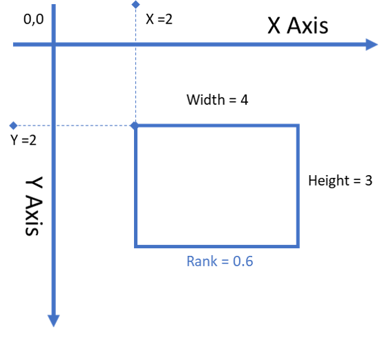

# CorpCorp Box Decisioning Algoritm
## Our Objective
We here at Corpcorp are very concerned with Boxes. People often send us files, full of boxes and we are then responsible for chosing the best boxes out of this file. In order to get only the finest boxes we
1. Look for overlapping boxes, and choose the best 1 based on a formula
2. Remove any poorly ranked boxes

## How do we choose the best boxes? 
Boxes come in CSV files, with 5 columns and a single header record. The columns are 4 Integer coordinates (`X,Y,Width,Height`) and one decimal value (`Rank`) (between zero and 1) representing the Rank. Rank is a representation of how important the box is, with a larger value (e.g 0.8) being more important than a smaller value (e.g. 0.4). There many be an arbitrarily large number of boxes in the file.

The X and Y coordinate refer to the top left corner of the box.

An example of a box file would look like this:
| X | Y | Width | Height | Rank |
|----|----|----|----|----|
| 2 | 2 | 4 | 3 | 0.8 |

This would give a box that looks like this:

The problem is, that some of these boxes overlap.
We want to minimise the number of boxes by suppressing some of them. 
Each boxes has a Rank which denotes how important it is. 
Higher rank values supercede lower values.

In order to determine which rectangles will be suppressed, we will use a technique called the Jaquard Index.
The formula for the Jaqard index is `(Intersecting area of the rectangles) divided by (Union of the area of the rectangles)`

If the Intersection over Union (Jaqard Index) is greater `0.4` (called the Jaqard index threshold), then the box with the lower Rank will be ignored.

In order to make our algorithm faster, we also have a Rank Threshold. Boxes with a rank lower than `0.5` will be ignored entirely! 

## What outcome do we get
We want a list of all boxes in a file that *do not* get suppressed by the above formula

## What do we want you to do?
In this fictional situation, you will have 2 tasks. 
### Task 1:
We have written an acceptance criteria with inputs and outputs. You are to write a C# automated test to validate that this is working

### Task 2:
The code does contain bugs, write out some additional acceptance criteria that the Devs can use to find the bugs.

### Task 3:
If you got this far, you are doing well. Write some automated tests to test your acceptance criteria

### Please note:
1. Tests should be written in C#
2. Tests should be able to be run using a test framework such as NUnit, XUnit, MSTest, etc
3. There are bugs in the program, we want you to find them
4. There is an example file [Boxes.csv](./Code/boxes.csv) for you to use as a reference. Feel free to copy it and modify it, it is randomised data.

## How do i use the program?

You can call the command line by building the project and calling the output executable `InterviewBenchmark.exe "input file"`
the result will be written to `bin\Debug\netcoreapp3.0\output.csv` if you are running it from visual studio, or the same directory as the executable if not.

Alternatively, you could use the `BoxSuppressor` class directly from coded component tests.

Happy testing!
